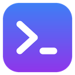
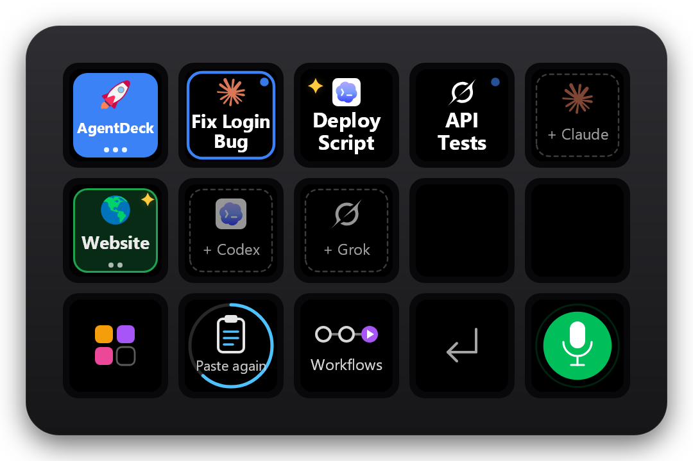
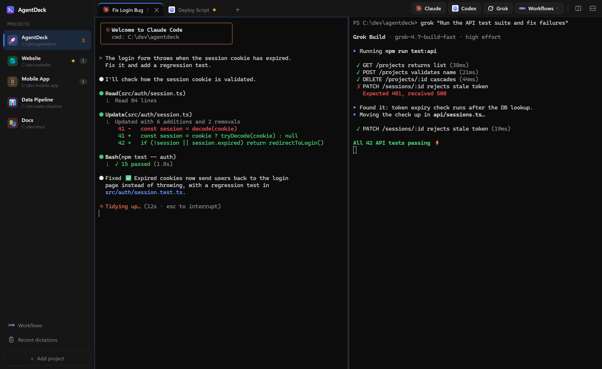
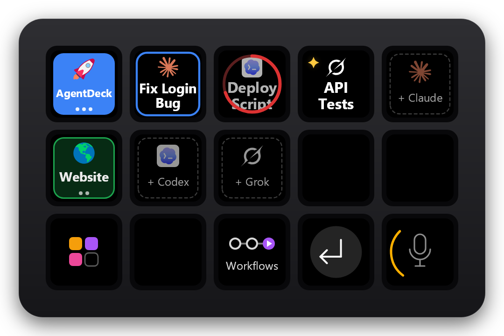
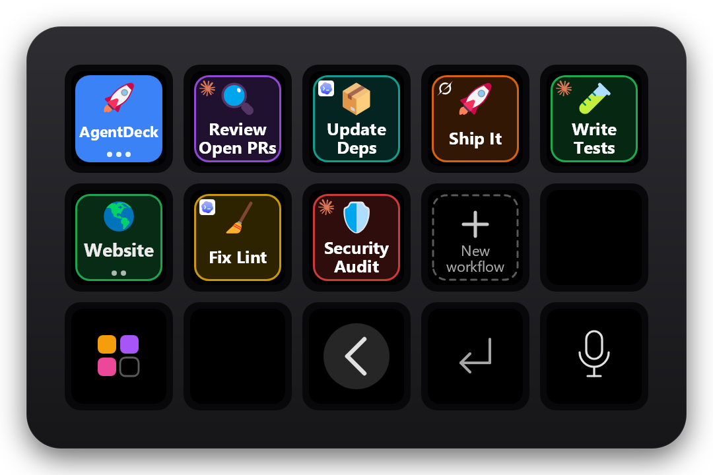
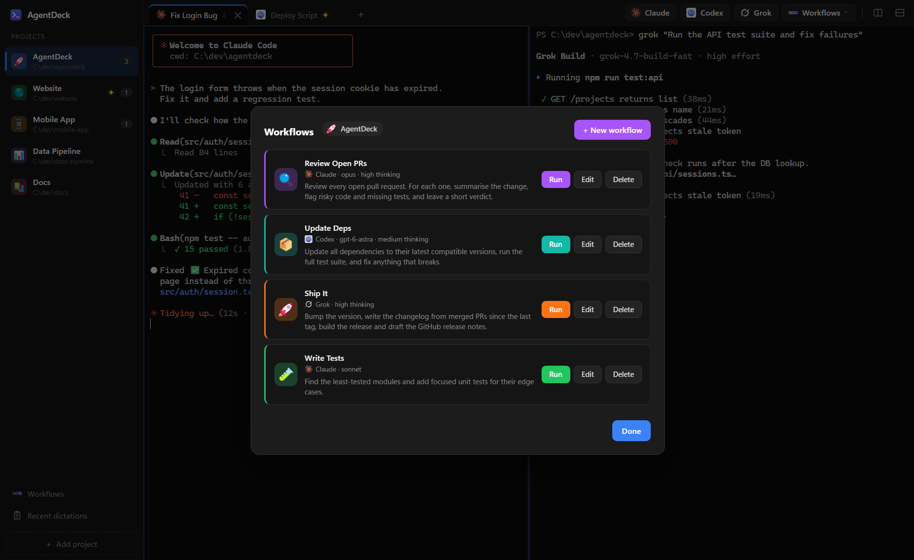
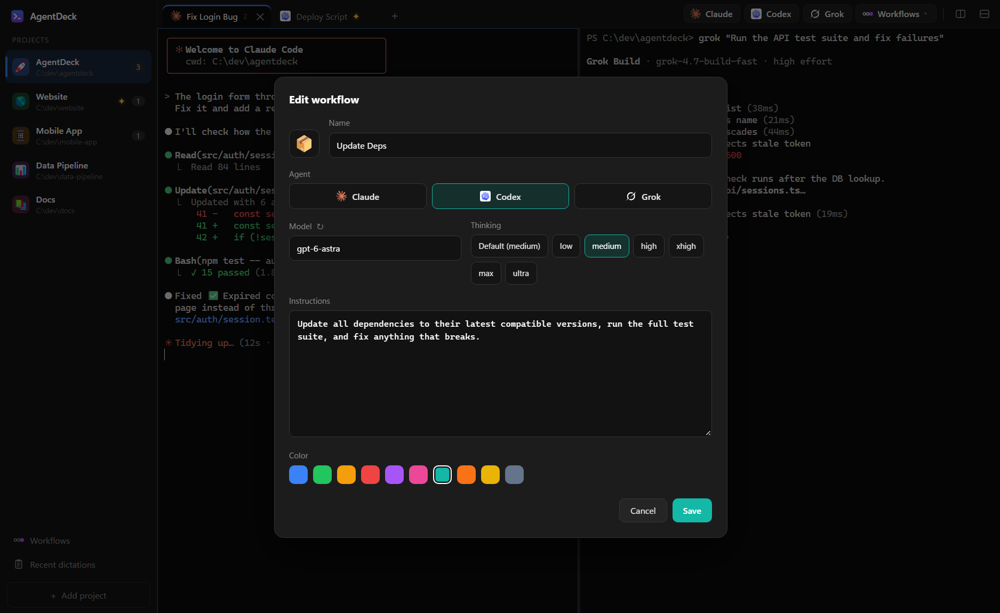
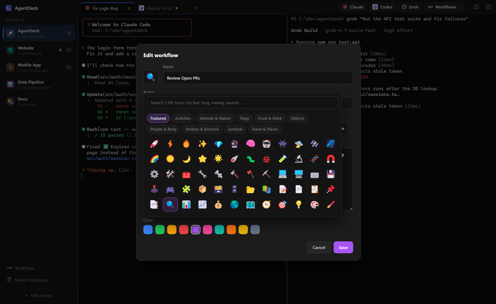
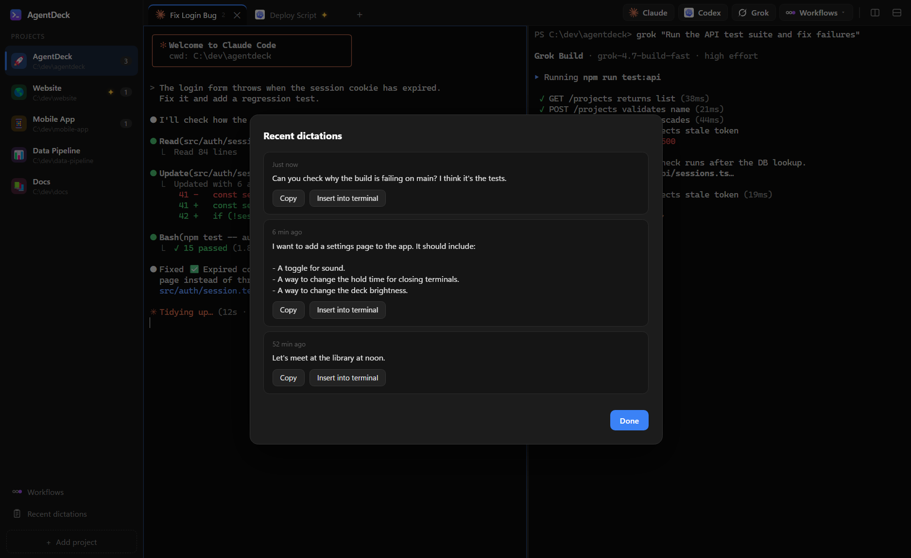

<div align="center">



# AgentDeck

**Windows terminal + Stream Deck control surface for Claude Code, Codex and Grok, with system-wide voice dictation.**




</div>



## 🎙️ System-wide voice dictation: a Wispr Flow alternative

Same flow as Wispr Flow: press a key, talk, press again, clean text appears. **Works in any app**, not just AgentDeck.

- **Trigger:** Stream Deck mic key, **`Ctrl+Shift+Win`** anywhere, or any mouse button mapped to it.
- **Fast:** audio streams to Soniox (`stt-rt-v5`) while you talk; the transcript is ready ~0.3 s after you stop.
- **Clean:** `gpt-6-luna` removes filler and repetition, fixes grammar, applies *"scratch that"*, and formats long dictation into paragraphs and bullets, in your own voice.
- **Targeted:** dictation started in an AgentDeck terminal lands in *that* terminal (and is submitted) even if you've switched apps.
- **Enter** mid-dictation = stop, paste, submit. **Double-tap** the mic = cancel.
- **Safety net:** last 10 transcripts in *Recent dictations*; a *Paste again* key for 10 s after each one.

## Features

| | |
|---|---|
| **Projects** | Each project is a folder with its own icon, color, terminals and workflows. |
| **Terminals** | ConPTY (same as Windows Terminal) + xterm.js/WebGL: tabs, split panes, 24-bit color, color emoji. |
| **Agents** | One press/click/shortcut opens Claude, Codex or Grok in the project folder. |
| **Stream Deck** | Projects, live sessions (logo + 2-word label), launchers, workflows, Enter, mic. Tap to jump, hold 0.8 s to close. No Elgato software needed. |
| **Finished alerts** | When an agent goes quiet after working: soft pop + ✦ on its key, tab and project. |
| **Workflows** | Saved prompt + agent + model + thinking level, per project. One press opens a tab with the agent already working. |
| **Model discovery** | Models and thinking levels are read from the CLIs at runtime, so new ones appear without an update. |
| **Icons** | 1,591 Fluent Emoji, searchable by meaning (*fast* → ⚡, *deploy* → 🚀). |
| **Always on** | Tray app, starts with Windows; closing the window keeps agents running. |

| Stream Deck | |
|---|---|
|  | **Left:** projects (bottom key opens a picker past 3). **Middle:** sessions with busy dot / ✦, then *+ agent* launchers. **Bottom:** Paste again, Workflows, Enter, mic. |
|  | Hold a session key: a red ring fills, then it closes. |
|  | **Workflows** swaps the session keys for this project's workflows. |






## Install

Requires Windows 11, the .NET 10 SDK and a 15-key Stream Deck (tested on MK.2; optional). Quit the Elgato app first.

```powershell
git clone https://github.com/EmanH/agentdeck.git
cd agentdeck\AgentDeck
powershell -ExecutionPolicy Bypass -File install.ps1
```

Installs a self-contained build to `%LOCALAPPDATA%\Programs\AgentDeck`, adds it to startup and launches it. Re-run to update.

| Env var | For |
|---|---|
| `SONIOX_API_KEY` | Dictation (required for dictation) |
| `OPENAI_API_KEY` | Transcript cleanup and session labels (optional) |

Agent CLIs on `PATH`: `claude`, `codex`, `grok`.

## Shortcuts

| Keys | Action |
|---|---|
| `Ctrl+Shift+Win` | Dictation start/stop (global; double-press cancels) |
| `Ctrl+Shift+1/2/3` | New Claude / Codex / Grok terminal |
| `Ctrl+Shift+T` · `Ctrl+Shift+W` | New shell tab · close pane |
| `Alt+Shift+=` · `Alt+Shift+-` · `Alt+Arrow` | Split right · split down · move focus |
| `Ctrl+Tab` · `Ctrl+=/-/0` | Next tab · font size |

## Privacy

Audio goes to Soniox only while the mic is on. Transcripts, and for untitled sessions your last few typed lines, go to OpenAI if `OPENAI_API_KEY` is set. Transcripts are stored locally (`%APPDATA%\AgentDeck`); logs contain timings only.

## More

- [Architecture](docs/ARCHITECTURE.md): ConPTY, UI protocol, deck render loop, dictation pipeline, agent discovery.
- `docs/tools/screenshots.ps1` regenerates these screenshots. `prototypes/python/` is the original prototype.

[MIT](LICENSE) · [Third-party notices](THIRD-PARTY-NOTICES.md) · Not affiliated with Anthropic, OpenAI, xAI, Elgato or Wispr.
