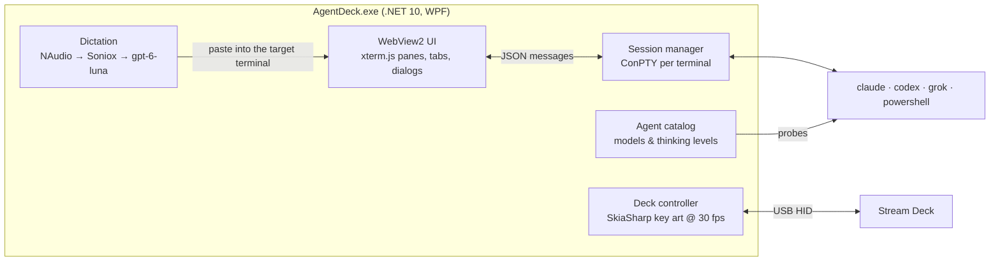

<div align="center">


# AgentDeck

**A command center for AI coding agents: a native Windows terminal plus a Stream Deck that runs your agents.**

Run Claude Code, Codex and Grok side by side in every project, see what each one is doing at a glance on
physical keys, talk instead of type, and get a tap on the shoulder the moment an agent needs you.


</div>


---

## Why AgentDeck?

Coding agents changed the job. You're no longer typing code all day: you're **directing several agents at once**,
across several repos, and waiting on them. Terminal tabs weren't built for that. You lose track of which tab is
doing what, you miss the moment an agent finishes or asks a question, and you type the same long prompts
over and over.

AgentDeck is built for exactly this way of working:

- 🗂️ **Projects, not tabs.** Every project is a folder with its own icon, color and terminals. Switch projects and
  your agents are right where you left them.
- 🎛️ **Your agents on physical keys.** Each running session gets a Stream Deck key with the agent's logo and a
  live two-word label of what it's working on. One press jumps straight to it.
- 🎙️ **Talk to your agents.** Tap the mic, speak, tap again. State-of-the-art streaming speech-to-text
  (Soniox), a quick AI tidy-up (it understands *"scratch that"*), and the text lands in the terminal you
  were in, even if you've moved on to another app.
- ✦ **Never miss a finish.** When an agent stops working, AgentDeck plays a soft pop and puts a gold star on
  its key, tab and project, so you know exactly who needs you.
- ⚡ **Workflows.** Save the prompts you run all the time ("review open PRs", "update deps") as one-press
  workflows with their own agent, model and thinking level.
- 🪟 **Native and always on.** A real Windows terminal (ConPTY, same plumbing as Windows Terminal) that lives
  in your tray, starts with Windows, and keeps agents running when the window is closed.

## Features

### 🖥️ A real terminal, organised by project

- Tabs and **split panes** like Windows Terminal (`Alt+Shift+=` / `Alt+Shift+-`), drag to resize, `Alt+Arrow` to move.
- Every terminal opens **in its project's folder**. Launch Claude, Codex or Grok with one click, one key
  (`Ctrl+Shift+1/2/3`) or one Stream Deck press.
- Full-fidelity rendering with xterm.js + WebGL: 24-bit color, **color emoji**, clickable links, Cascadia Mono.
- Terminals run with a **clean login environment**, so agents behave exactly as they do in Windows Terminal.

### 🎛️ The Stream Deck becomes mission control

| | |
|---|---|
|  | **Left column:** your projects, with their icons. More than three? The bottom key opens a project picker.<br><br>**Middle:** the selected project's live sessions: agent logo, a live label, a pulsing dot while it works, and a ✦ when it's done. Empty slots become **+ Claude / + Codex / + Grok** launchers.<br><br>**Bottom row:** Paste again, Workflows, Enter and the dictation mic. |
|  | **Tap** a session to jump to it (the window comes forward and the terminal is focused).<br><br>**Hold** for 0.8 s to close it: a red ring fills around the key so you never close one by accident.<br><br>Keys are drawn live at 30 fps and only redrawn when something changes. No Elgato software needed. |

**Live labels.** Claude Code names its own tasks (e.g. *Fix Login Bug*) and AgentDeck shows that title.
For agents that don't, `gpt-6-luna` summarises what you asked into two words.

### 🎙️ Voice dictation that actually keeps up

- **Start / stop** from the mic key, **Ctrl+Shift+Win**, or any button you map to it (e.g. a Logitech mouse button).
- **Fast:** audio streams to Soniox while you talk, so the transcript is ready ~0.3 s after you stop.
- **Clean:** `gpt-6-luna` fixes grammar, removes filler and repetition, applies *"scratch that"* corrections,
  and turns long monologues into paragraphs and bullet points, while keeping your voice.
- **Goes where you meant it:** start dictating in an AgentDeck terminal, switch to your browser, stop, and the
  text still lands in that terminal (and is submitted, because you're not there to press Enter).
- **Enter to submit:** press the deck's Enter key mid-dictation to stop, paste *and* send in one go.
- **Double-tap to cancel.** Changed your mind? Double-tap the mic and nothing is pasted or saved.
- **Nothing is lost:** your last 10 transcripts are kept (*Recent dictations*), and a **Paste again** key
  appears for 10 seconds after each one.


### ✦ Finished alerts

AgentDeck watches each session: once you've submitted something and the agent has been working, silence
means it's **done or waiting for you**. You get a subtle pop and a gold ✦ on the session's key and tab (and on
the project, if you're elsewhere). Look at it and the star clears.

### ⚡ Workflows: your best prompts, one press away


- A workflow is **instructions + an agent + (optionally) a model and thinking level**, saved per project.
- Run it from the Stream Deck (**Workflows** key → pick one), the tab bar, or the project's start page. It opens a new
  tab with the agent already working on your instructions.
- **Models and thinking levels are discovered at runtime** from the CLIs themselves, so new models show up
  without an AgentDeck update. Codex even reports which thinking levels each model supports.


| On the deck | |
|---|---|
|  | Press **Workflows** and your project's workflows take over the session keys, each with its own icon, color and agent badge. Pick one and go. |

### 🎨 1,591 icons for projects and workflows

Every project and workflow gets its **own unique icon** from Microsoft's colorful Fluent Emoji set, shown in
the app and on the keys. Browse by category or **search by meaning**: *fast* finds ⚡, *deploy* finds 🚀,
*debug* finds 🐛.


## Getting started

### Requirements

- **Windows 11** and the **.NET 10 SDK** (to build).
- A **15-key Stream Deck** (built and tested on the MK.2). Quit the Elgato Stream Deck app: only one program
  can drive the deck at a time. AgentDeck works without a deck too.
- The agent CLIs you want on your `PATH`: [Claude Code](https://docs.anthropic.com/claude-code) (`claude`),
  [Codex CLI](https://github.com/openai/codex) (`codex`), Grok Build (`grok`).
- For dictation: a **`SONIOX_API_KEY`** user environment variable. For the AI tidy-up and live labels:
  **`OPENAI_API_KEY`** (optional: without it you get the raw transcript and plain labels).

### Install

```powershell
git clone https://github.com/EmanH/agentdeck.git
cd agentdeck\AgentDeck
powershell -ExecutionPolicy Bypass -File install.ps1
```

`install.ps1` builds a self-contained release into `%LOCALAPPDATA%\Programs\AgentDeck`, registers it to start
with Windows (toggle from the tray menu) and launches it. Run it again any time to update.

### Keyboard shortcuts

| Shortcut | Action |
|---|---|
| `Ctrl+Shift+Win` | Start / stop dictation (global; double-press cancels) |
| `Ctrl+Shift+1` / `2` / `3` | New Claude / Codex / Grok terminal in this project |
| `Ctrl+Shift+T` | New shell tab |
| `Alt+Shift+=` / `Alt+Shift+-` | Split right / split down |
| `Alt+Arrow` | Move between panes |
| `Ctrl+Tab` / `Ctrl+Shift+Tab` | Next / previous tab |
| `Ctrl+Shift+W` | Close pane |
| `Ctrl+C` / `Ctrl+V`, right-click | Copy (with a selection) / paste |
| `Ctrl+=` / `Ctrl+-` / `Ctrl+0` | Font size |

## How it works



- **Terminals** are real Windows pseudo consoles (ConPTY) driven from C#, rendered by xterm.js in WebView2.
- **The deck** is driven directly over USB HID (StreamDeckSharp); every key is drawn with SkiaSharp.
- **Workflows** pass your instructions as the agent's initial prompt, so there's no race with a starting shell.

Deeper dive: [docs/ARCHITECTURE.md](docs/ARCHITECTURE.md).

## Privacy

- **Audio** streams to Soniox only while the mic is on. **Transcripts** go to OpenAI for the tidy-up (if
  `OPENAI_API_KEY` is set).
- For live labels on agents that don't set a title, the **last few lines you typed** in that terminal are sent
  to OpenAI to produce two words.
- Your last 10 transcripts are stored locally (`%APPDATA%\AgentDeck\transcripts.json`). The log records timings
  only, never transcript text.

## Repository layout

```
AgentDeck/            The app (C# + web UI)
  Core/               Projects, sessions, workflows, agent discovery, icons, OpenAI client
  Deck/               Stream Deck controller and key art
  Dictation/          Mic capture, Soniox streaming, cleanup
  Native/             ConPTY, keyboard hook, input and window helpers
  wwwroot/            UI (HTML/CSS/JS, xterm.js, icon library)
  tools/              Icon library build script
docs/                 Architecture notes, screenshots and the screenshot tooling
prototypes/python/    Where it started: a Python Stream Deck + dictation prototype
```

## Contributing

Issues and pull requests are welcome. Ideas on the roadmap:

- Other Stream Deck sizes (XL, Mini, +) with adaptive layouts
- Settings page (sound, hold time, brightness, dictation language)
- More agents (anything with a CLI) and custom launch profiles
- Session restore across restarts

To refresh the screenshots after UI changes: `powershell -File docs\tools\screenshots.ps1`.

## License

[MIT](LICENSE). See [THIRD-PARTY-NOTICES.md](THIRD-PARTY-NOTICES.md) for the open-source components and
trademarks. AgentDeck is an independent project, not affiliated with Anthropic, OpenAI, xAI or Elgato.
