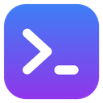
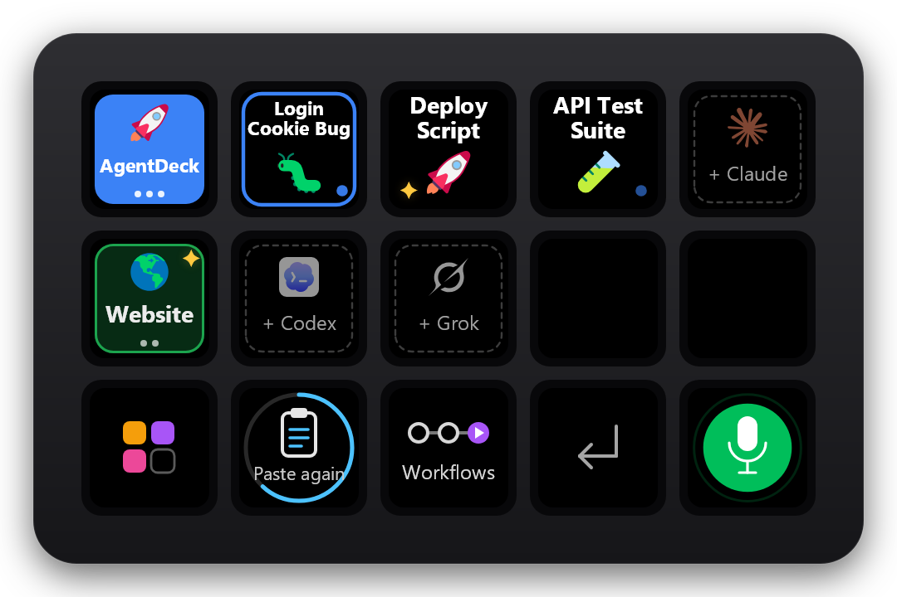
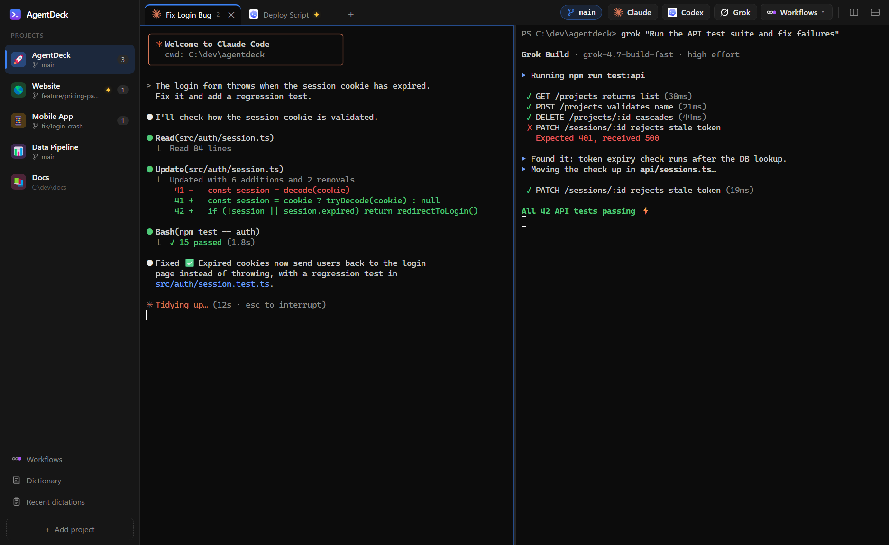
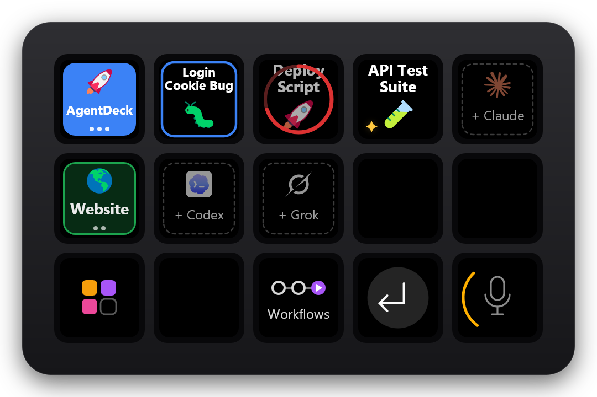
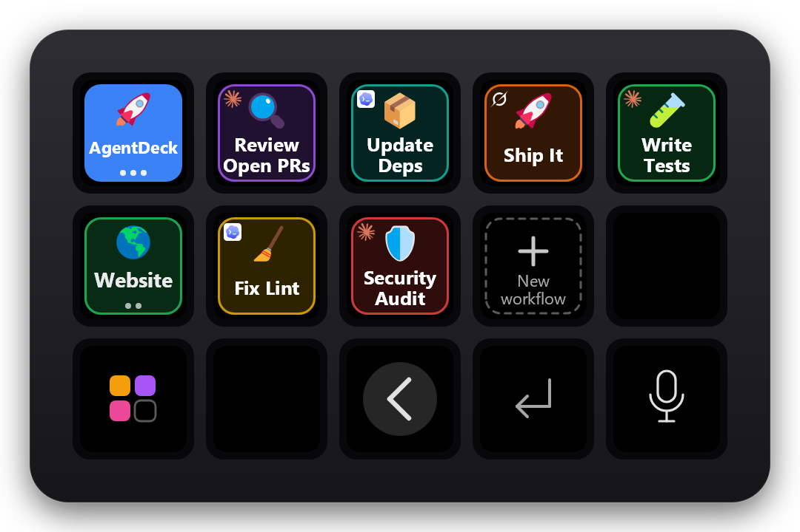
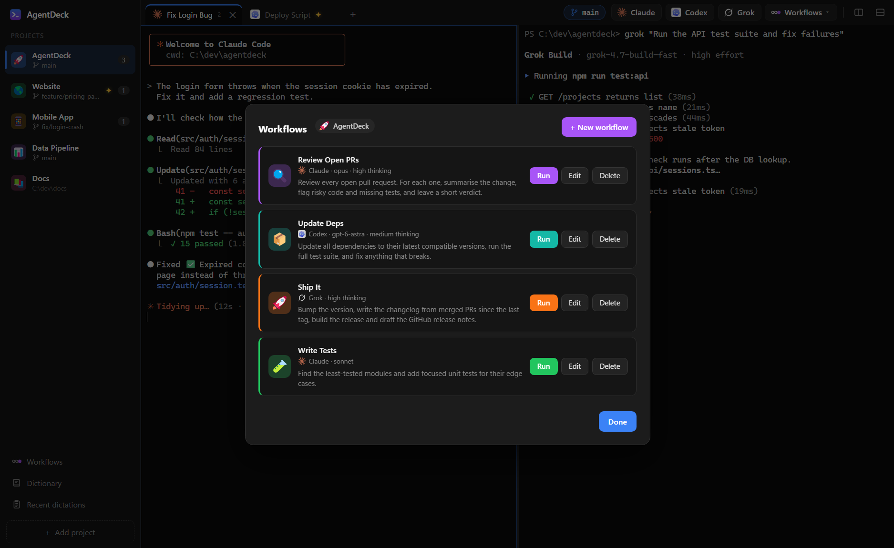
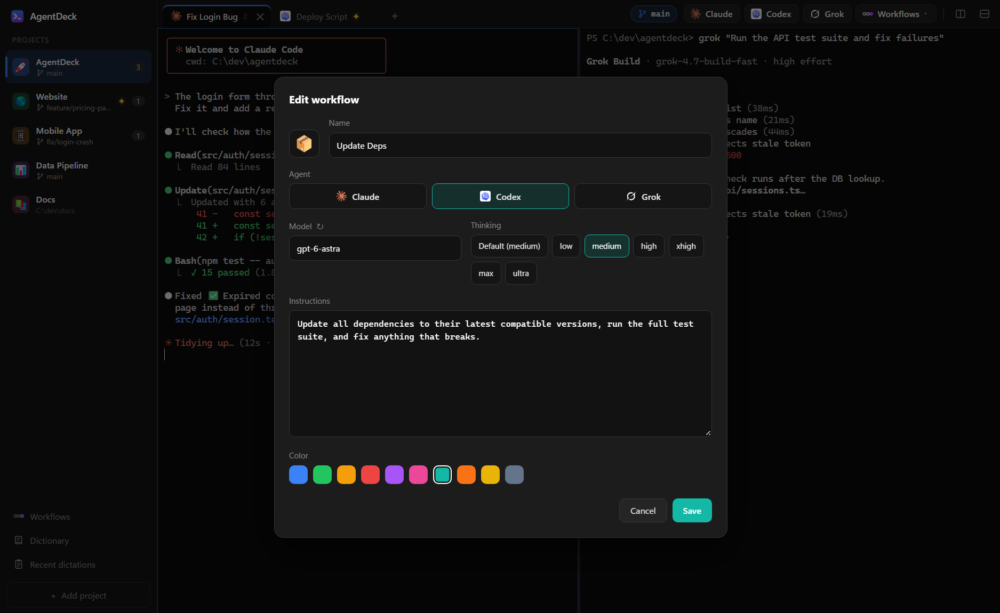
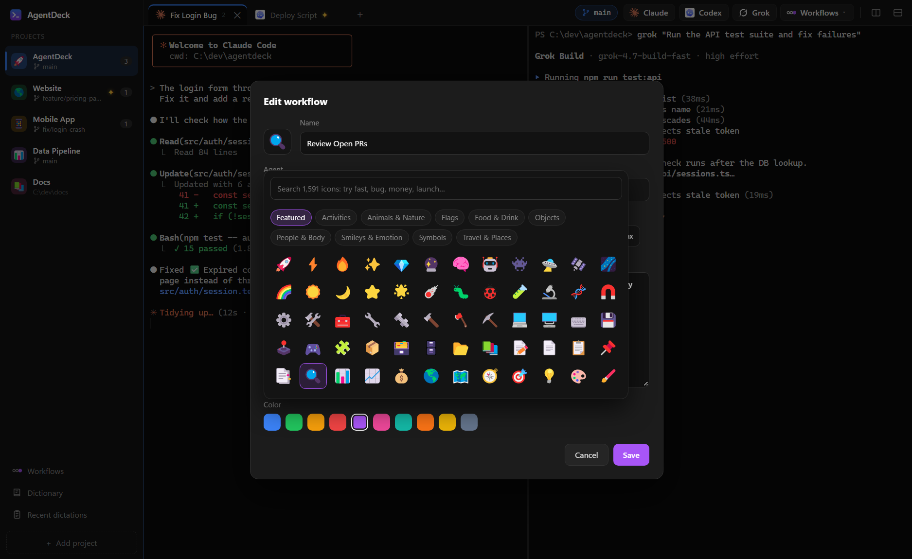
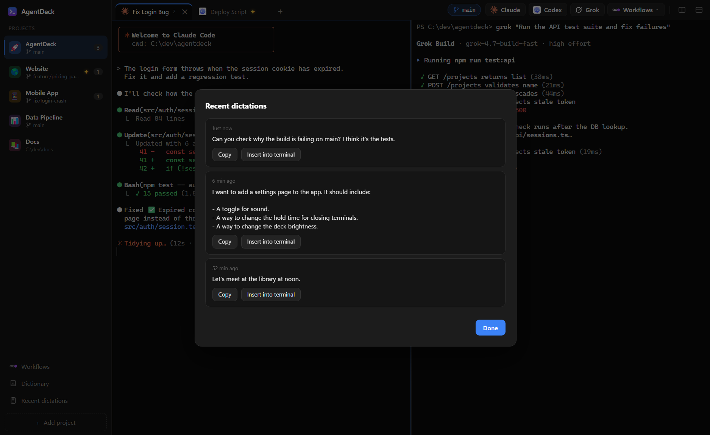

<div align="center">



# AgentDeck

**A thin wrapper around your agents' real terminal UIs, for running many Claude Code, Codex and Grok sessions across many projects. Plus a Stream Deck control surface and system-wide voice dictation.**




</div>



## Same agents, same terminal UIs, just organised

AgentDeck is not a new agent UI. Claude Code, Codex and Grok run **unmodified, in real terminals**
(ConPTY, the same plumbing as Windows Terminal), so every TUI feature, keybinding, slash command and update
works exactly as it does in your usual terminal. AgentDeck only adds a thin layer around them:

- **Sessions grouped by project:** every project is a folder with its own tabs, split panes and agents; switch projects and they're right where you left them.
- **Mix agents freely:** Claude, Codex, Grok and plain shells side by side, each opened in the project folder in one press.
- **See every session at once:** AI titles and icons that follow each conversation, busy dots and ✦ finished alerts in the tabs and on the Stream Deck, so you know which agent needs you.
- **Know where you are:** each project's current git branch, in the sidebar and the tab bar, updated as you check out.
- **Jump anywhere:** one key press brings any session to the front, in any project.

## 🎙️ System-wide voice dictation: a Wispr Flow alternative

Same flow as Wispr Flow: press a key, talk, press again, clean text appears. **Works in any app**, not just AgentDeck.

- **Trigger:** Stream Deck mic key, **`Ctrl+Shift+Win`** anywhere, or any mouse button mapped to it.
- **Fast:** audio streams to Soniox (`stt-rt-v5`) while you talk; the transcript is ready ~0.3 s after you stop.
- **Clean:** `gpt-6-luna` removes filler and repetition, fixes grammar, applies *"scratch that"*, and formats long dictation into paragraphs and bullets, in your own voice.
- **Targeted:** dictation started in an AgentDeck terminal lands in *that* terminal (and is submitted) even if you've switched apps.
- **Launch and talk:** a deck *+ Claude / + Codex / + Grok* key opens the agent and starts dictating into it immediately; the text waits until the agent is ready.
- **Custom dictionary:** your names and jargon are sent to Soniox as context and to the cleanup, which fixes near-misses (*sonics* → *Soniox*).
- **Audio cues:** a soft rising pop when the mic opens, the same pop falling when it closes.
- **Enter** mid-dictation = stop, paste, submit. **Double-tap** the mic = cancel.
- **Safety net:** last 10 transcripts in *Recent dictations*; a *Paste again* key for 10 s after each one.

## Features

| | |
|---|---|
| **Projects** | Each project is a folder with its own icon, color, terminals and workflows. |
| **Terminals** | Real ConPTY terminals (same as Windows Terminal) rendered with xterm.js/WebGL: tabs (drag to reorder), split panes, 24-bit color, color emoji. Drop files on a terminal to paste their paths. Agent TUIs run unchanged. |
| **Agents** | One press/click/shortcut opens Claude, Codex or Grok in the project folder. |
| **Stream Deck** | Projects, live sessions (title + icon), launchers, workflows, Enter, mic. Tap to jump, hold 0.8 s to close. No Elgato software needed. |
| **Session titles & icons** | Every 30 s, terminals whose screen changed get a 2-4 word title (`gpt-6-luna`) and an emoji picked by the TypeSafe Jev classifier from ~160 work-themed icons. Idle terminals cost nothing. |
| **Git branch** | The selected project's branch in the tab bar; every project's branch in the sidebar. |
| **Live status** | Working tabs show a spinning ring and shimmer; when an agent goes quiet after working: soft pop + ✦ on its key, tab and project. |
| **Workflows** | Saved prompt + agent + model + thinking level, per project. One press opens a tab with the agent already working. |
| **Model discovery** | Models and thinking levels are read from the CLIs at runtime, so new ones appear without an update. |
| **Icons** | 1,591 Fluent Emoji, searchable by meaning (*fast* → ⚡, *deploy* → 🚀). |
| **Always on** | Tray app, starts with Windows; closing the window keeps agents running. |

| Stream Deck | |
|---|---|
|  | **Left:** projects (bottom key opens a picker past 3). **Middle:** sessions with busy dot / ✦, then *+ agent* launchers. **Bottom:** Paste again, Workflows, Enter, mic. |
|  | Hold a session key: a red ring fills, then it closes. |
|  | **Workflows** swaps the session keys for this project's workflows. |






## Install

Requires Windows 11, the .NET 10 SDK and a 15-key Stream Deck (tested on MK.2; optional). Quit the Elgato app first.

```powershell
git clone https://github.com/EmanH/agentdeck.git
cd agentdeck\AgentDeck
powershell -ExecutionPolicy Bypass -File install.ps1
```

Installs a self-contained build to `%LOCALAPPDATA%\Programs\AgentDeck`, adds it to startup and launches it. Re-run to update.

No SDK? Download `AgentDeck-*-win-x64.zip` from [Releases](https://github.com/EmanH/agentdeck/releases), unzip anywhere and run `AgentDeck.exe` (it adds itself to startup on first run; toggle from the tray).

| Env var | For |
|---|---|
| `SONIOX_API_KEY` | Dictation (required for dictation) |
| `OPENAI_API_KEY` | Transcript cleanup and session titles (optional) |
| `TYPESAFE_AI_API_KEY` | Session icons on the Stream Deck (optional) |
| `AGENTDECK_API_TOKEN` | Optional Bearer token for the localhost control API |
| `AGENTDECK_API_PORT` | Control API port (default `17832`) |

Agent CLIs on `PATH`: `claude`, `codex`, `grok`.


## Local control API

AgentDeck exposes a localhost-only HTTP JSON API (default `http://127.0.0.1:17832`) so an external assistant can monitor and orchestrate the same actions as the UI and Stream Deck. Binds on startup; if the port is taken it logs and continues without the API. Optional auth: set `AGENTDECK_API_TOKEN` and send `Authorization: Bearer <token>`. Override the port with `AGENTDECK_API_PORT`.

| Method | Path | Body |
|---|---|---|
| GET | `/health` | |
| GET | `/state` | projects, selected, sessions (id/projectId/agent/label/done/working/busy/active), branches |
| GET | `/workflows` | |
| POST | `/projects/select` | `{ "id" }` |
| POST | `/sessions/new` | `{ "projectId?", "agent", "prompt?", "model?", "effort?", "name?" }` |
| POST | `/sessions/{id}/activate` | |
| POST | `/sessions/{id}/close` | |
| POST | `/sessions/{id}/input` | `{ "data" }` raw PTY write |
| POST | `/sessions/{id}/paste` | `{ "text", "submit?" }` |
| POST | `/sessions/{id}/enter` | |
| POST | `/workflows/{id}/run` | |
| POST | `/launch` | `{ "agent" }` (opens agent + starts dictation, like the deck) |
| POST | `/dictation/toggle` | |
| POST | `/window/show` | |

```powershell
curl.exe http://127.0.0.1:17832/health
curl.exe http://127.0.0.1:17832/state
curl.exe -X POST http://127.0.0.1:17832/launch -H "Content-Type: application/json" -d "{\"agent\":\"claude\"}"
curl.exe -X POST http://127.0.0.1:17832/workflows/WORKFLOW_ID/run
```

## Shortcuts

| Keys | Action |
|---|---|
| `Ctrl+Shift+Win` | Dictation start/stop (global; double-press cancels) |
| `Ctrl+Shift+1/2/3` | New Claude / Codex / Grok terminal |
| `Ctrl+Shift+T` · `Ctrl+Shift+W` | New shell tab · close pane |
| `Alt+Shift+=` · `Alt+Shift+-` · `Alt+Arrow` | Split right · split down · move focus |
| `Ctrl+Tab` · `Ctrl+=/-/0` | Next tab · font size |

## Privacy

Audio goes to Soniox only while the mic is on. Transcripts, and for untitled sessions your last few typed lines, go to OpenAI if `OPENAI_API_KEY` is set. To title and icon a terminal, the last 80 lines of its screen go to OpenAI and TypeSafe (whichever keys are set) every 30 s while it's changing. Transcripts are stored locally (`%APPDATA%\AgentDeck`); logs contain timings and session titles, never transcript or terminal text.

## More

- [Architecture](docs/ARCHITECTURE.md): ConPTY, UI protocol, deck render loop, dictation pipeline, agent discovery.
- `docs/tools/screenshots.ps1` regenerates these screenshots. `prototypes/python/` is the original prototype.

[MIT](LICENSE) · [Third-party notices](THIRD-PARTY-NOTICES.md) · Not affiliated with Anthropic, OpenAI, xAI, Elgato or Wispr.
